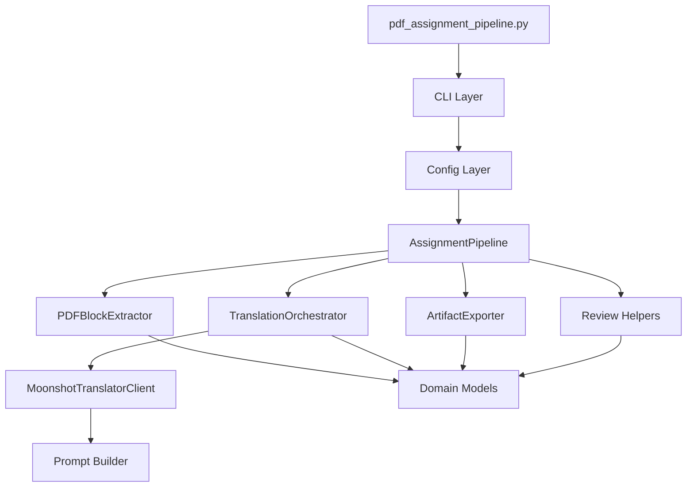

# LLM-BatchTrans

面向批量翻译任务的 Python 工具仓库，当前包含两条能力链路：

- 旧版 CSV 物料翻译链路：`data_process.py` + `validation.py`
- 新版 PDF 作业交付链路：`pdf_assignment_pipeline.py` + `llm_batchtrans/`

这次重构的重点是把 PDF 作业链路做成真正可交付、可审计、可维护的工程化流水线，而不是把所有逻辑堆在一个脚本里。

## Current Capabilities

### Legacy CSV Pipeline

适用于短文本、物料描述、工业元件名称一类的批量翻译与打分：

- `data_process.py`
  - 从 CSV 读取单列原文
  - 使用历史翻译构建简化翻译记忆
  - 调用大模型生成英文译文
- `validation.py`
  - 对中英对照结果再次调用模型打分
  - 输出带评分的 CSV

### Layered PDF Pipeline

适用于论文、教材章节、技术说明文档等 PDF 翻译作业：

- 提取 PDF 文本
- 按页和块切分
- 并发调用 Moonshot `kimi-k2-thinking-turbo`
- 自动抽取术语
- 导出老师需要的三个交付物
  - 中文译文 `docx`
  - 英中对照 `xlsx`
  - 术语对照表 `xlsx`
- 同时保留日志、自检报告和 JSON 原始结果

## Architecture


```mermaid
flowchart TD
    A["pdf_assignment_pipeline.py"] --> B["CLI Layer"]
    B --> C["Config Layer"]
    C --> D["AssignmentPipeline"]
    D --> E["PDFBlockExtractor"]
    D --> F["TranslationOrchestrator"]
    F --> G["MoonshotTranslatorClient"]
    G --> H["Prompt Builder"]
    D --> I["ArtifactExporter"]
    D --> J["Review Helpers"]
    E --> K["Domain Models"]
    F --> K
    I --> K
    J --> K
```

详细说明见 [docs/ARCHITECTURE.md](docs/ARCHITECTURE.md)。

## Repository Layout

```text
LLM-BatchTrans/
├── data_process.py
├── validation.py
├── pdf_assignment_pipeline.py
├── requirements.txt
├── .env.example
├── llm_batchtrans/
│   ├── __init__.py
│   ├── cli.py
│   ├── config.py
│   ├── exporters.py
│   ├── logging_utils.py
│   ├── models.py
│   ├── moonshot_client.py
│   ├── pdf_extractor.py
│   ├── pipeline.py
│   ├── prompting.py
│   ├── review.py
│   ├── text_utils.py
│   └── translation_service.py
├── docs/
│   └── ARCHITECTURE.md
└── dataset_test/
```

## Setup

### 1. Install Dependencies

建议先创建虚拟环境，然后安装依赖：

```bash
python3 -m venv .venv
source .venv/bin/activate
pip install -r requirements.txt
```

如果你仍然使用本仓库里的本地依赖目录 `.vendor/`，运行时可以这样：

```bash
PYTHONPATH=.vendor python3 pdf_assignment_pipeline.py --limit-blocks 3
```

### 2. Configure Environment

复制示例文件并填写 Moonshot Key：

```bash
cp .env.example .env
```

`.env` 已被 `.gitignore` 忽略，不会进入版本库。

关键环境变量：

```env
MOONSHOT_API_KEY=your-api-key
MOONSHOT_BASE_URL=https://api.moonshot.cn/v1
MOONSHOT_MODEL=kimi-k2-thinking-turbo
MAX_WORKERS=200
MAX_RETRIES=4
REQUEST_TIMEOUT=180
CHUNK_SIZE_CHARS=1800
RPM_LIMIT=4800
RETRY_BASE_DELAY=2.0
```

## Usage

### Smoke Test

先跑前几个块验证链路是否正常：

```bash
PYTHONPATH=.vendor python3 pdf_assignment_pipeline.py \
  --pdf 200-228.pdf \
  --limit-blocks 3 \
  --max-workers 3
```

### Full PDF Run

```bash
PYTHONPATH=.vendor python3 pdf_assignment_pipeline.py \
  --pdf 200-228.pdf \
  --max-workers 96 \
  --rpm-limit 4800
```

## Output Artifacts

每次运行都会在 `outputs/<pdf_name>_<timestamp>/` 下生成：

- `*_提取文本.xlsx`
- `*_提取文本.csv`
- `*_英中对照.xlsx`
- `*_英中对照.csv`
- `*_术语对照表.xlsx`
- `*_中文译文.docx`
- `*_自检报告.md`
- `*_result.json`
- `run_config.json`
- `logs/run_*.log`

## Logging and Review

这条链路默认把信息分成两层：

- 命令行：保留关键进度
- 日志文件：保留完整执行轨迹

自检报告会重点给出：

- 失败块数量
- 中文占比异常的块
- 可用于人工复核的风险提示

## Notes on Throughput

高并发不是简单把线程数调高。

当前实现里：

- `MAX_WORKERS` 控制并发线程数
- `RPM_LIMIT` 控制请求发射速度
- 请求层自带退避重试

这样既能尽量吃满平台额度，又能减少首轮爆发式请求带来的 `429`。

## Legacy Scripts

旧脚本仍然保留，方便继续处理现有 CSV 任务：

```bash
python3 data_process.py
python3 validation.py
```

但它们并不参与新的 PDF 作业链路，也没有采用新的模块化架构。

## License

Apache License 2.0. See [LICENSE](LICENSE).
