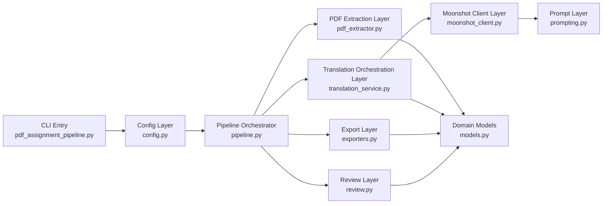

# Architecture

## Overview

The repository now has two tracks:

- Legacy CSV-based scripts for industrial material translation:
  - `data_process.py`
  - `validation.py`
- A layered PDF assignment pipeline for academic/technical documents:
  - `pdf_assignment_pipeline.py`
  - `llm_batchtrans/`

The PDF pipeline is organized by responsibility instead of keeping extraction, networking, export, and review logic inside one file.

## Layered Design

## Module Responsibilities

| Module | Responsibility |
| --- | --- |
| `llm_batchtrans/config.py` | Load `.env`, define runtime settings, mask secrets for exported config metadata |
| `llm_batchtrans/models.py` | Domain dataclasses for blocks, translation results, extraction reports, and artifacts |
| `llm_batchtrans/logging_utils.py` | Console + file logging bootstrap |
| `llm_batchtrans/text_utils.py` | Page cleanup, chunking, term normalization, simple heuristics |
| `llm_batchtrans/pdf_extractor.py` | Convert PDF pages into ordered text blocks |
| `llm_batchtrans/prompting.py` | Build the translation prompt contract |
| `llm_batchtrans/moonshot_client.py` | Session reuse, global request pacing, retries, JSON parsing |
| `llm_batchtrans/translation_service.py` | Parallel block scheduling and progress logging |
| `llm_batchtrans/review.py` | Self-review heuristics and report generation |
| `llm_batchtrans/exporters.py` | Write DOCX/XLSX/CSV/JSON/Markdown artifacts |
| `llm_batchtrans/pipeline.py` | End-to-end orchestration |
| `llm_batchtrans/cli.py` | CLI argument parsing and top-level runtime wiring |

## Why This Structure

- Extraction, LLM I/O, export, and review have different failure modes and evolve independently.
- The Moonshot client is isolated, so changing providers later does not require touching the exporter or extractor.
- The orchestration layer stays readable because it only coordinates the layers below it.
- Logging stays centralized and every run produces a durable audit trail.

## Throughput and Stability

The pipeline supports high concurrency, but it now also includes a global request pacing layer.

- `MAX_WORKERS` controls thread-level parallelism.
- `RPM_LIMIT` controls request launch rate.
- Retries back off automatically on transient failures and `429`.

This avoids the “burst all requests immediately” behavior that caused early throttling in the first version.
